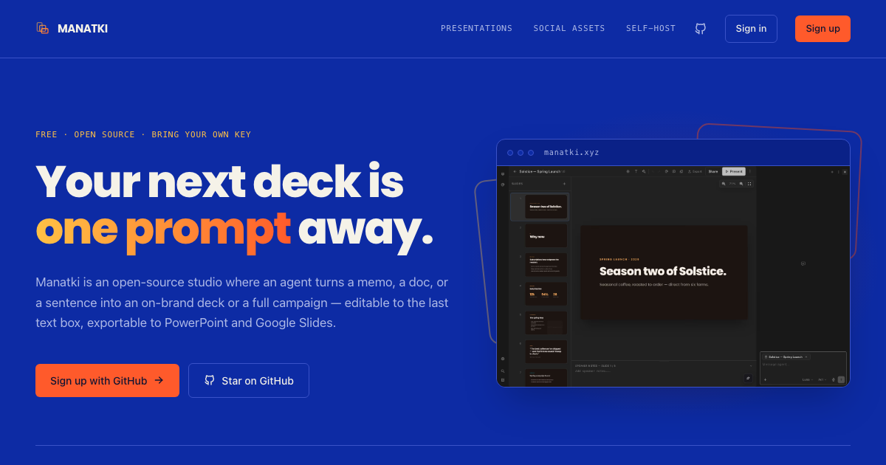
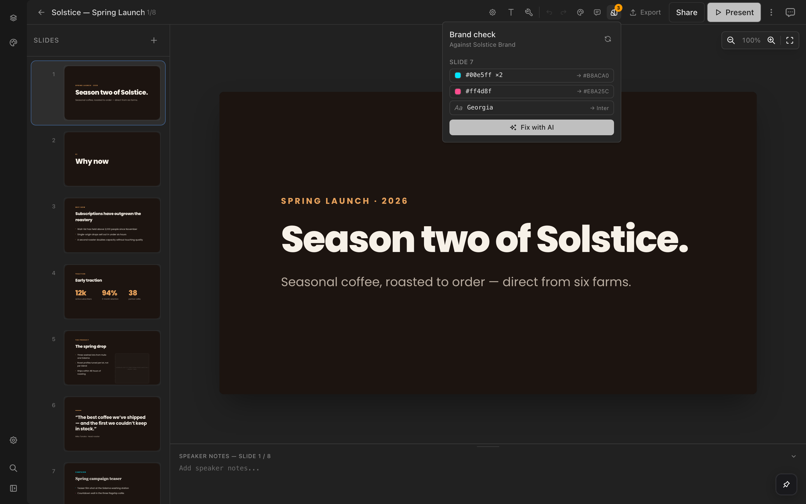
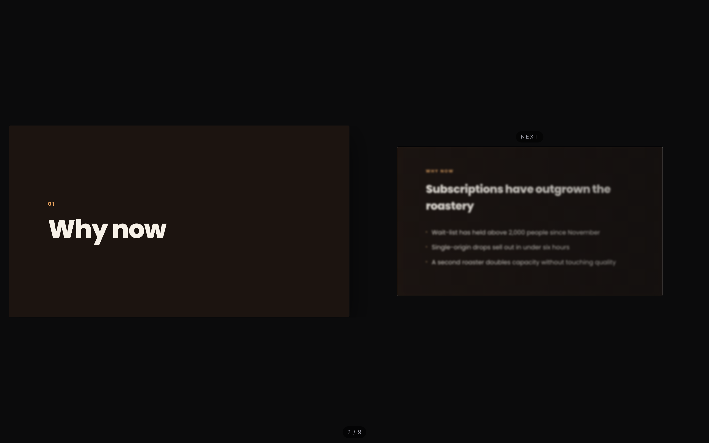
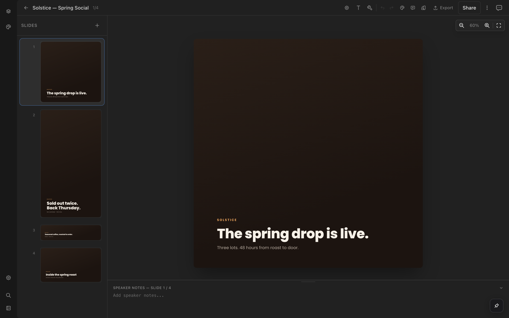
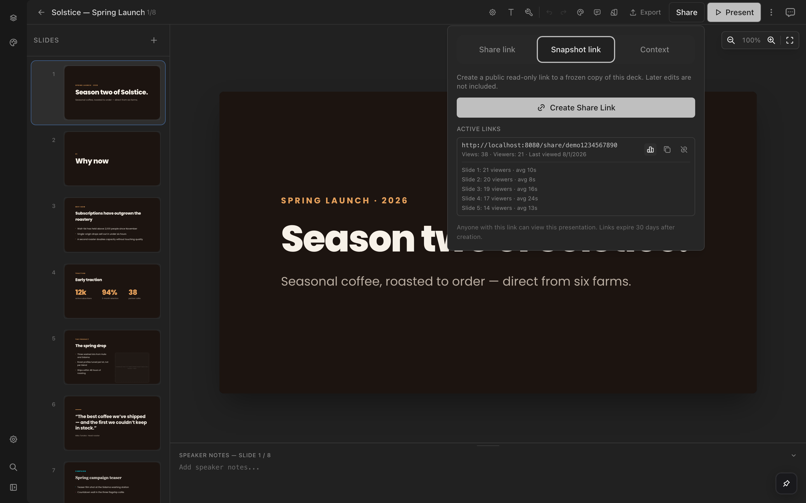

<div align="center">


# Manatki

**Your next deck is one prompt away.**

An open-source, agent-native studio for presentations and marketing assets.
Talk to it — get a real, editable deck or a full multi-format campaign.

[**manatki.xyz**](https://manatki.xyz) · [Presentations](https://manatki.xyz/presentations) · [Social assets](https://manatki.xyz/social-assets) · [Self-host](https://manatki.xyz/self-host)

[](./LICENSE)
[](https://manatki.xyz)
[](https://manatki.xyz/self-host)



</div>

---

Everything the editor can do, chat can do too:

```
> make a 12-slide deck from this memo, on our brand
> add a slide about pricing after the roadmap
> make a campaign set for the spring launch
> attach these screenshots to slide 3
> export this deck to Google Slides
```

## Why Manatki

- **Genuinely agent-native** — the same ~110 actions back the UI and the chat
  agent. Create, edit, reorder, theme, illustrate, import, export, share:
  nothing is editor-only.
- **Real output, not screenshots** — export native editable PPTX (text and
  shapes stay real, speaker notes included), Google Slides straight into your
  Drive, PDF, HTML, and per-asset PNG.
- **Free, and honestly free** — there is no billing code in this repository.
  You bring your own OpenAI key; it's stored encrypted per user, and
  generation runs at your provider's prices.

## What's inside

| | |
| --- | --- |
|  | **On brand, provably.** Point Manatki at a website, brand doc, or code file and it becomes a reusable design system. A deterministic brand linter flags off-palette colors and off-brand fonts per slide — and "Fix with AI" hands the findings to the agent for targeted repairs. |
|  | **A presenter stage built for talking.** Current slide sharp on the left, the next one treated on the right — five preview styles cycled live with `V`. Attach screenshots to a slide and they take over the pane as a browsable grid. |
|  | **One campaign, every format.** Social projects give every asset its own pixel canvas — 16 presets from Instagram square to story to leaderboard, composed per format with story safe areas. Export PNG per asset or the set as a ZIP. |
|  | **Share it, then see what landed.** Share links track views, unique viewers, and per-slide dwell time — anonymous by design (random client-minted session ids, never identity). |

Plus: imports from PDF, PPTX, DOCX, Google Docs, code files, or a URL ·
image-folder-to-deck in one drag · comments with canvas pins · live presence ·
version history with restore · 12 UI locales.

## Presenter controls

| Key | Action |
| --- | --- |
| `→` `↓` `Space` `PgDn` | Next slide |
| `←` `↑` `PgUp` | Previous slide |
| `Home` / `End` | First / last slide |
| `F` | Fullscreen |
| `V` | Cycle preview style |
| `T` | Presenter timer |
| Click screenshot | Magnify; `←`/`→` walk the set; `Esc` close |

## Run it locally

```bash
pnpm install
pnpm dev
```

That's the whole setup: it serves at http://localhost:8080 on SQLite with
auth switched off (`AUTH_DISABLED=true` in `.env`), so you can be editing a
deck a minute after cloning. Add keys in `.env` or through the in-app
Settings panel — see `.env.example`.

## Deploy

The default target is Vercel (Nitro `vercel` preset):

| | |
| --- | --- |
| Database | Neon Postgres (`DATABASE_URL`), or any SQL that Drizzle speaks |
| File storage | Vercel Blob (`BLOB_READ_WRITE_TOKEN`), swappable for S3/R2 via `server/plugins/file-upload.ts` |
| Auth | Better Auth with GitHub OAuth (`GITHUB_CLIENT_ID`, `GITHUB_CLIENT_SECRET`, `BETTER_AUTH_SECRET`) |
| AI | None server-side — users bring their own key. Optional `GEMINI_API_KEY` as a shared image-generation fallback |

## License

[MIT](./LICENSE) — run it, fork it, ship it.
